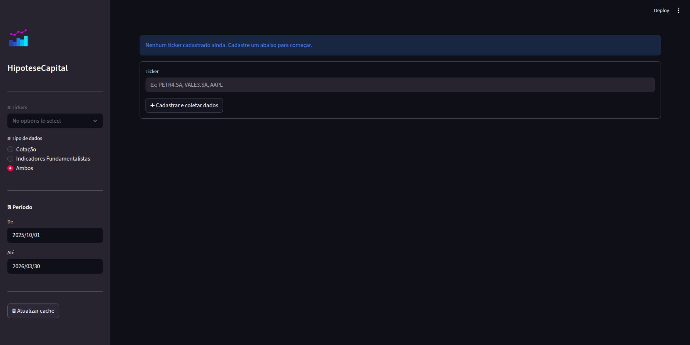

# Case de Data Science & AI da Charles River Capital

Este repositório tem como objetivo realizar as fases 1 e 2 (obrigatórias) do case apresentado pela Charles River Capital. O case completo está disponível em *case/Case DS&AI CR.pdf*.

## Resumo

O objetivo é realizar a coleta de dados sobre tickers de ações da B3 (https://www.b3.com.br/). Tais dados englobam:

* **Cadastro**: nome da empresa responsável, setor e segmento de atuação e uma descrição resumida do modelo de negócio da empresa, utilizando uma API ou scrapper.
* **Cotação**: Cotação atual, data da última cotação, mínimo e máximo em 52 semanas, volume médio de negociação (em 2 meses), valor de mercado da empresa, data do último balanço e número de ações (não foi especificado no documento, então escolhi esses dados), utilizando uma API ou scrapper.
* **Indicadores Fundamentalistas**: P/L, ROE, Dívida Líquida/EBITDA, Margem Líquida e *Dividend Yield*, utilizando uma API ou scrapper.
* **Notícias**: Síntese de 5 notícias, classificando-as como NEGATIVA, NEUTRA e POSITIVA, utilizando uma *LLM*.

Além da coleta, há a geração de um relatório profissional (também utilizando uma *LLM*) - contendo todos os dados supracitados, uma interpretação dos valores atuais dos indicadores e 3 perguntas que um analista deveria investigar antes de tomar uma decisão - e um *Dashboard* minimamente interativo para o usuário final.

Por fim, também devemos salvar tais dados em um banco SQL, tratando ddados *high* e *low frequence*. Além disso, no código, devemos realizar tratamentos de erros para informações incompletas, APIs não respondendo e sites com erro 400.


## Ferramentas

Para a *IDE*, utilizei o *Virtual Studio Code* (https://code.visualstudio.com/download). Em conjunto, para o versionamento, utilizei o *GitHub* (https://github.com) e o terminal *Git Bash* (https://git-scm.com/install/windows).

Como linguagem de programação optei por usar Python, além de um pouco de SQL para estruturar o banco de dados com a biblioteca *sqlalchemy*.

Para a parte da coleta de dados, usei as bibliotecas Python *yfinance* e *bs4* (*BeatifulSoup*) e os sites *Status Invest, Investidor 10, B3, Trading View* e *Fundamentus*.

Para a parte de síntese de dados e geração do relatório, usei as APIS das LLMs Gemini (https://ai.google.dev/gemini-api/docs/api-key) e Claude (https://platform.claude.com/settings/keys). Lembrando que, para usar indeterminadamente, haverá cobrança para com os tokens de cada LLM.

Para o dashboard, utilizei as bibliotecas Python *streamlit*, *matplotlib* e *seaborn*.


## Árovre do repositório

```bash

|--case                         
|--|--Case DS&AI CR.pdf         # Arquivo detalhado do case
|--public                       # Pasta que guarda imagens e relatórios de teste
|--src                          
|--|--backend                   # Pasta que guarda as operações backend
|--|--|--llm_utils.py           # Módulo para operações com LLM
|--|--|--scrapper1.py           # Módulo que utiliza a biblioteca yfinance
|--|--|--scrapper2.py           # Módulo que utiliza de webscrapping
|--|--dashboard                 # Pasta que guarda as operações do dashboard e do relatório
|--|--|--generate_report.py     # Módulo que cria o dashboard interativo junto com o relatório
|--|--database                  # Pasta que guarda as operações do banco de dados
|--|--|--sql                    # Pasta que guarda os arquivos de modelagem SQL
|--|--|--|--CREATE_TABLES.sql   # 
|--|--|--|--DROP_TABLES.sql     #
|--|--|--__init__.py            # Módulo que define as tabelas no sqlalchemy 
|--|--|--database.py            # Módulo que gere as operações nas tabelas
|--|--utils                     # Pasta que guarda algumas funções reutilizáveis
|--|--|--__init__.py
|--env-template                 # Arquvivo que guarda um template de .env
|--main.py                      # Script principal
|--requirements.txt             # Arquivo que guarda todas as bibliotecas usadas
```


## Configurando o ambiente

Execute o seguinte passo a passo no terminal do Git Bash (tanto no Windows, quanto no Linux):

```bash
git clone https://github.com/alexoliveiraFGV24/charles-river-case-dsia.git # Clone via HTTPS
ou
git clone git@github.com:alexoliveiraFGV24/charles-river-case-dsia.git # Clone via chave SSH

cd charles-river-case-dsia

python -m venv venv

source venv/bin/activate # Linux
ou
source venv/Scripts/activate # Windows

pip install -r requirements.txt

touch .env # Cria o arquivo .env (informações sensíveis)
```

Depois de realizado o passo a passo, altere o .env seguindo o passo a passo do arquivo env-template

Para obter as chaves API necessárias, vá em **Ferramentas**.


## Criando o banco de dados

Execute o passo a passo no terminal Git Bash:

```bash
# Instalação (usando pacman) com configuração de senha root e segurança básica
sudo pacman -Syu
sudo pacman -S mysql # Instale com o MariaDB
sudo systemctl status mysql
sudo systemctl start mysql
sudo systemctl enable mysql
sudo mysql_secure_installation # Atualize a senha para OWNER_PASSWORD do .env

# Criando o banco
# O usuário e a senha estão no .env
sudo mysql -u root -p
CREATE DATABASE IF NOT EXISTS HipoteseCapital CHARACTER SET utf8mb4 COLLATE utf8mb4_unicode_ci;
CREATE USER 'seu_usuario'@'localhost' IDENTIFIED BY 'sua_senha';
GRANT ALL PRIVILEGES ON HipoteseCapital.* TO 'seu_usuario'@'localhost';
FLUSH PRIVILEGES;
SHOW DATABASES; # Ver se HipoteseCApital foi criada
USE HipoteseCApital # Acessar a database
# Crie as tabelas assim como no arquivo src/database/sql/CREATE_TABLES.sql

```

Ou vá em https://dev.mysql.com/downloads/installer/ para instalar no Windows.


## Execuntando o projeto
```bash
streamlit run main.py
```

Você deverá ver algo como na imagem:


