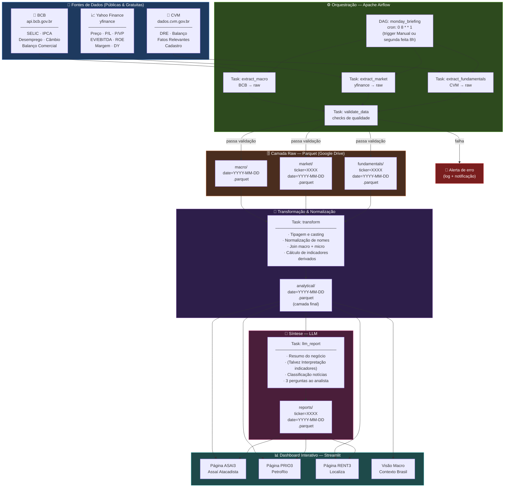

# Arquitetura do Pipeline — Centralizador de Análise



---

## Camadas do Pipeline

| Camada | Tecnologia | Responsabilidade |
|--------|-----------|-----------------|
| **Extração** | `python-bcb`, `yfinance`, `requests` | Coleta dados brutos das fontes públicas |
| **Orquestração** | Apache Airflow | Agendamento, dependências entre tasks, retry e alertas |
| **Raw** | Parquet · Google Drive | Armazena dados brutos particionados por data/ticker |
| **Transformação** | pandas / polars | Normalização, join das fontes, cálculo de indicadores |
| **Analítica** | Parquet · Google Drive | Camada final limpa, pronta para consumo |
| **Síntese** | LLM API (Claude / OpenAI) | Relatório interpretativo por empresa |
| **Visualização** | Streamlit | Dashboard interativo por empresa + visão macro |

---

## Tickers Monitorados (PoC)

| Ticker | Empresa | Setor |
|--------|---------|-------|
| ASAI3 | Assaí Atacadista | Varejo Alimentar |
| PRIO3 | PetroRio | Commodities / Petróleo |
| RENT3 | Localiza Hertz | Serviços / Mobilidade |

---

## Frequência de Execução

```
DAG agendada: toda segunda-feira às 8h
Objetivo: dados prontos antes da reunião de comitê das 14h
```
