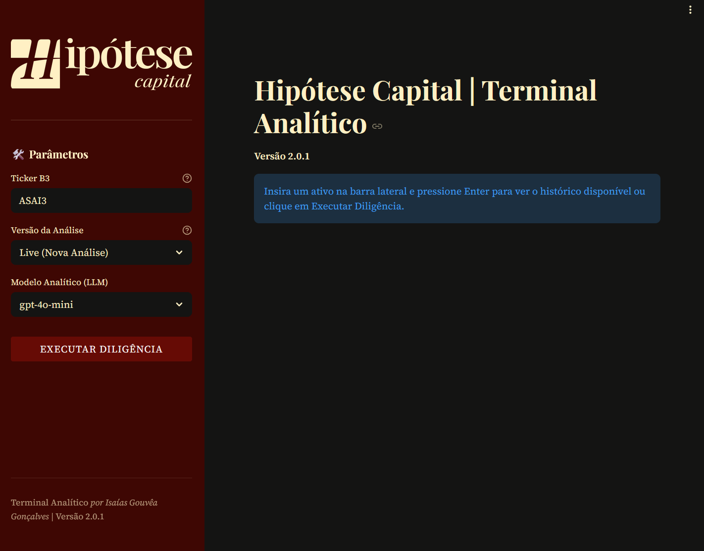
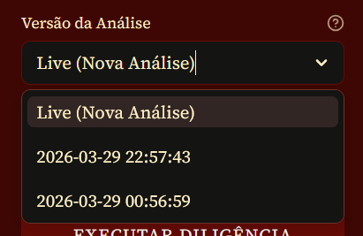
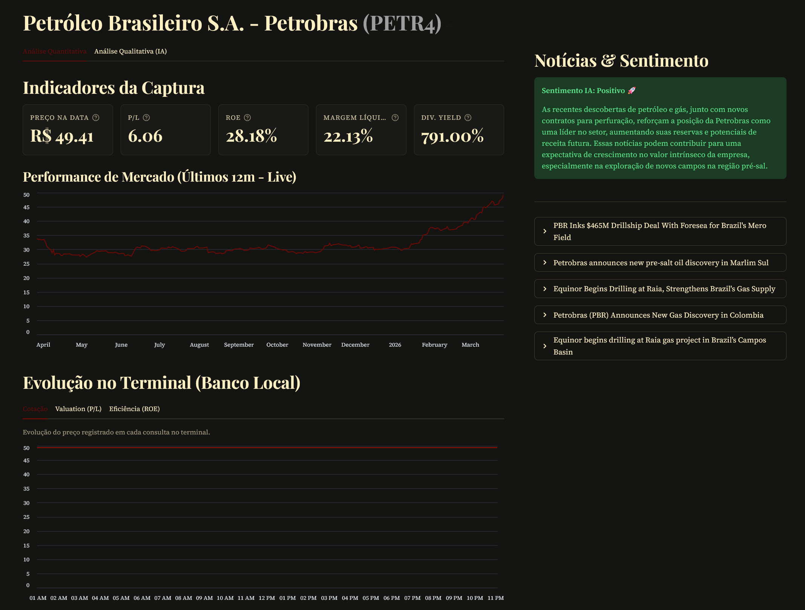
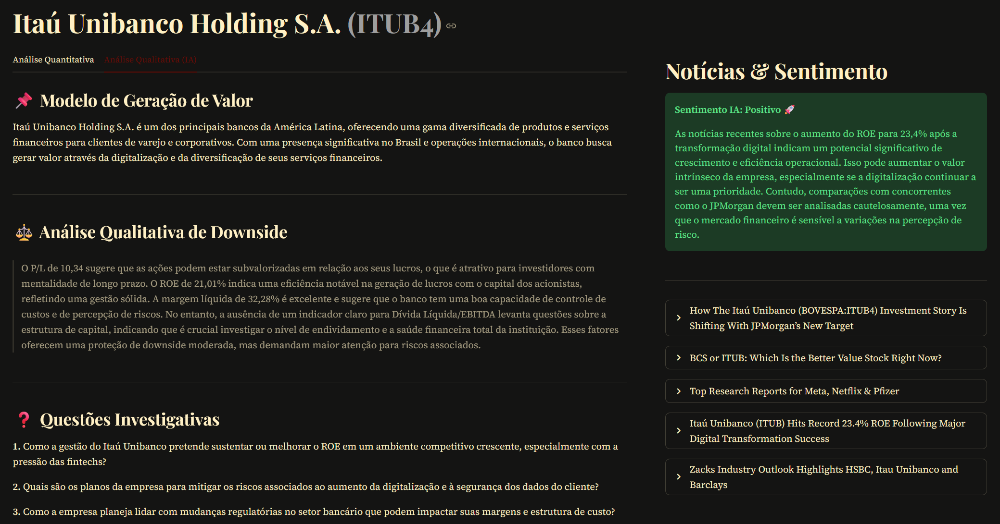
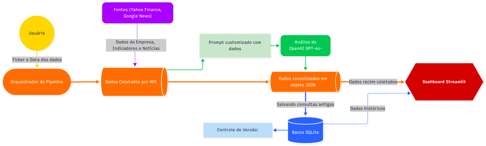
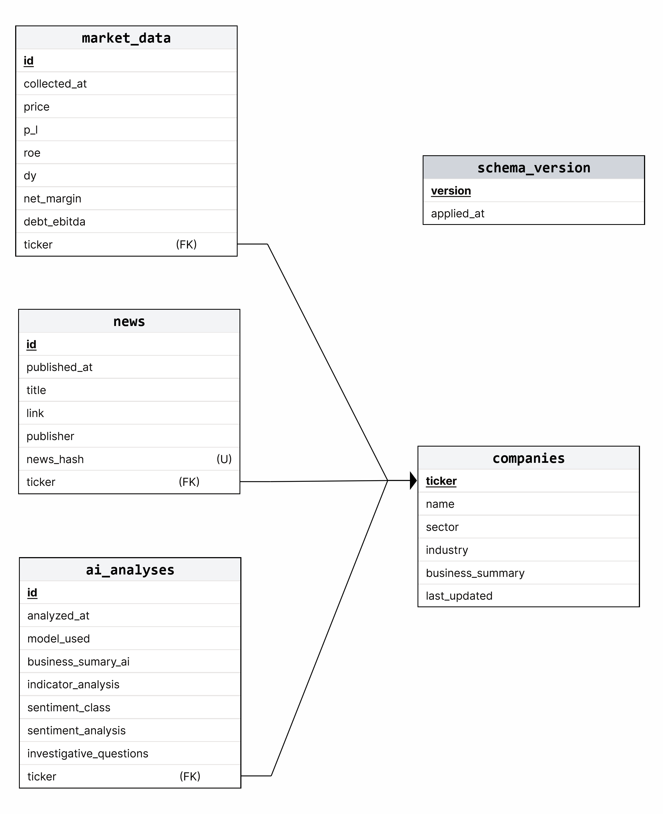

# 


# Terminal de Inteligência Analítica - Hipótese Capital


Este repositório contém o Terminal Analítico desenvolvido por *Isaías Gouvêa Gonçalves* para a **Hipótese Capital**, uma gestora de investimentos fictícia focada em *Value Investing*. 

## A Ferramenta

O aplicativo oferece uma interface interativa para consultas de dados financeiros de empresas listadas no [B3](www.b3.com.br) a partir
do [Yahoo Finance](https://finance.yahoo.com/) e do [Google News](https://news.google.com/). Além de consulta dos dados,
é oferecida uma **análise de sentimento** dos fatos coletados, a partir de uma interpretação sob ótica do *value investing* feita
por ferramentas de Inteligência Artificial (IA). 

A ideia é ser uma **caixa de ferramentas** para **analistas do mercado financeiro**
**economizarem tempo** e **tomarem melhores decisões** diante de um ambiente tão frenético.

## Como utilizar
O sistema automatiza a coleta e armazenamento de dados a partir de um Ticker da B3 e exibe as análises em um dashboard interativo.

A aplicação estará temporariamente disponível no link _https:/hipotesecapital.duckdns.org_, mas também pode ser executada localmente _(Para isso, veja as instruções de como Executar)_.
Ao abrir o terminal, a interface mostrada será esta:




### Realizando a consulta
Para realizar uma consulta, digite no campo `Ticker B3` o Ticker desejado e pressione `Enter`. Caso haja registros anteriores
para aquele Ticker no banco de dados, você poderá verificar consultas anteriores na caixa `Versão da Análise` como na imagem abaixo:



Caso queira consultar algum registro antigo, selecione a data dele no campo mostrado e execute normalmente.
Se sua consulta for nova, mantenha a seleção em `Live (Nova Análise)` e depois clique em `Executar Diligência`. 

Após o carregamento e análise das informações, os dados serão mostrados no dashboard como abaixo:




### Elementos da Interface
Nessa primeira tela, são exibidos na primeira coluna:

- Dados de Indicadores relevantes de mercado para aquela empresa
- O gráfico de histórico do valor da ação daquela empresa
- Comparação dos valores dos indicadores registrados no banco de dados com os valores obtidos na consulta (só aparece caso existir registro anterior para aquela empresa)

Na coluna direita, são exibidos:

- Análise de sentimento das notícias feitas pela Inteligência Artificial
- Até 5 notícias mais recentes da empresa

Acima da coluna esquerda, você poderá alterar para a aba de `Análise Qualitativa (IA)` que terá a tela abaixo:



Aqui você encontrará:
- Resumo sobre a operação da empresa
- Análise Qualitativa dos indicadores recentes
- 3 perguntas investigativas sobre potenciais riscos para a empresa

Todas feitas por inteligência artificial. Caso queira executar o aplicativo localmente, você terá liberdade de **customizar
o prompt enviado à inteligência artificial** e fazer as análises da forma que preferir. Saiba mais no tópico de configuração.

---

## Arquitetura e Pipeline de Dados

O Terminal Analítico foi projetado seguindo princípios de **Engenharia de Dados Moderna**, priorizando a resiliência na coleta, a integridade na persistência e a utilidade analítica para estratégias de *Value Investing*.

### Stack utilizada no projeto

- **Linguagem**: Python 3.13+
- **Interface**: Streamlit
- **Banco de Dados**: SQLite3 (com suporte a Foreign Keys e Migrations)
- **IA**: OpenAI GPT-4o-mini
- **Coleta de Dados**: yfinance, curl_cffi (anti-bot), python-dateutil
- **Testes**: Pytest (com Mocking de rede e banco em memória)

### Estrutura do Projeto

Os diretórios do projeto foram organizados da seguinte forma:

```text
CaseStudyFinance/
├── src/
│   ├── app.py              # Script principal
│   ├── core/               # Lógica do Pipeline (Collector, Analyzer, Database, Orchestrator)
│   ├── ui/                 # Interface de usuário (Streamlit)
│   ├── utils/              # Loggers
│   └── config.py           # Configurações centralizadas e Prompts
│
├── tests/                  # Suite de testes unitários
├── migrations/             # Scripts de evolução do banco de dados
├── branding/               # Identidade visual (Logos e ícones)
├── images/                 # Imagens utilizadas no README
│
├── .envexample             # Arquivo exemplo das variáveis de ambiente
├── .streamlit/             # Configuração do Streamlit
├── pytest.ini              # Configuração do path de testes
├── docker-compose.yml      # Arquivos do Docker
├── Dockerfile              # 
├── README.md               # Este arquivo de instruções
├── GEMINI.md               # Instruções para o Agente de IA externo
├── DEPLOY_GUIDE.md         # Instruções para Deploy com Docker
└── requirements.txt        # Dependências do projeto
```

### Funcionamento do Pipeline
O processo de coleta e tratamento dos dados ocorre nos algoritmos em `src/core/` e é exemplificado no fluxograma abaixo:



De forma mais detalhada:

#### 1. Orquestração e Memória (Orchestrator)
O sistema utiliza um `AnalyticalOrchestrator` que atua como o cérebro da operação. Ele decide entre:
*   **Pipeline Live:** Executa o ciclo completo de coleta, análise via IA e persistência.
*   **Recuperação Histórica:** Reconstrói o estado completo de uma análise passada a partir do SQLite, evitando custos de API e garantindo que o analista veja exatamente o que a IA pensou naquela data.

#### 2. Ingestão Resiliente (Data Collection)
O `DataCollector` garante a continuidade do serviço mesmo sob restrições:
*   **Anti-Blocking:** Utiliza `curl_cffi` com impersonate "chrome" para evitar erros 403.
*   **Dual-Source News:** Combina notícias do Yahoo Finance com um fallback para Google News RSS quando necessário.
*   **Validação Cronológica:** Filtra notícias para garantir que apenas fatos ocorridos nos últimos 90 dias alimentem o modelo de IA.

#### 3. Inteligência Qualitativa (AI Analysis)
O `InvestmentAnalyzer` transforma dados brutos em insights estratégicos:
*   **Prompt Engineering Sênior:** Utiliza templates que forçam o modelo a adotar a persona de um analista fundamentalista.
*   **Output JSON Determinístico:** Força o modelo a responder em formato JSON estruturado, garantindo que o dashboard nunca quebre.
*   **Análise de Sentimento com Evidência:** Classifica o tom das notícias e justifica a decisão com base nos fatos coletados.

#### 4. Persistência e Integridade (Storage)
O `DatabaseManager` gerencia o ciclo de vida dos dados:
*   **Migrations Automáticas:** Scripts SQL versionados garantem que o esquema do banco esteja sempre atualizado.
*   **Políticas de Atualização:** Implementa lógica de expiração (7 dias) para dados cadastrais, garantindo que o perfil da empresa não fique obsoleto sem necessidade de re-coleta constante.
*   **Deduplicação MD5:** Gera hashes únicos para notícias, impedindo que títulos repetidos poluam o banco e a interface.

### Estrutura do banco de dados

A base de dados SQLite está estruturada da seguinte forma:




---
## Instruções técnicas

### Como executar localmente: 

#### 1. Requisitos Prévios
Certifique-se de ter o Python instalado, recomenda-se o uso de um ambiente virtual. 

Também é necessário ter uma chave da OpenAI para acessar o modelo de IA.
Isso pode ser feito na [Plataforma da OpenAI](https://platform.openai.com/api-keys) mediante cadastro e compra de créditos.

#### 2. Configuração do Ambiente
Clone o repositório e instale as dependências:
```bash
# Clone o repositório
git clone https://github.com/isaiasgoncalves/CaseStudyFinance.git
cd CaseStudyFinance

# Crie e ative o ambiente virtual
python -m venv venv
source venv/bin/activate  # Linux/Mac
.\venv\Scripts\activate   # Windows

# Instale os pacotes
pip install -r requirements.txt
```

#### 3. Variáveis de Ambiente
Crie um arquivo `.env` na raiz do projeto seguindo o modelo `.envexample`, sua chave da OpenAI será usada aqui:
```env
OPENAI_API_KEY=sua_chave_aqui
OPENAI_MODEL=gpt-4o-mini
```

Você pode modificar o modelo de IA caso queira, optando por algum que seja da sua preferência. Para essa análise, o modelo
selecionado consumiu cerca de 1300 _tokens_ por consulta, mas isso pode variar de acordo com o tamanho da empresa consultada e
do prompt.


#### 4. Execução
Para iniciar o terminal analítico localmente:
```bash
streamlit run src/app.py
```
No seu terminal você terá acesso ao link local para o dashboard e aos _logs_ do aplicativo.

Você também pode fazer deploy utilizando **Docker**, para isso, siga as instruções contidas em `DEPLOY_GUIDE.md`.

---

### Testes
O sistema conta com um sistema de testes unitários para verificar a integralidade das funcionalidades. Para executar os testes, execute o comando abaixo
no seu terminal (certifique-se de ter instalado das dependências do projeto)
```bash
python -m pytest tests/
```

### Configurações do aplicativo

O arquivo `src/config.py` contém as configurações gerais do projeto. Ali você poderá personalizar alguns dos parâmetros da interface
de usuário e funcionamento do pipeline. Recomendamos, no entanto, que não modifique nada sem saber exatamente o que está sendo feito.

Ali você encontrará também os **prompts** utilizados pelo modelo de IA nas análises qualitativas. São os valores `SYSTEM_PERSONA`
e `VALUE_INVESTING_ANALYSIS_PROMPT`. Caso queria modificar o segundo, se atente aos valores entre chaves como (e.g.  `{setor}`),
eles serão substituídos pelos dados coletados pelo algoritmo, e caso algum seja removido, o sistema irá parar de funcionar.


---
**Desenvolvido por Isaías Gouvêa Gonçalves**

